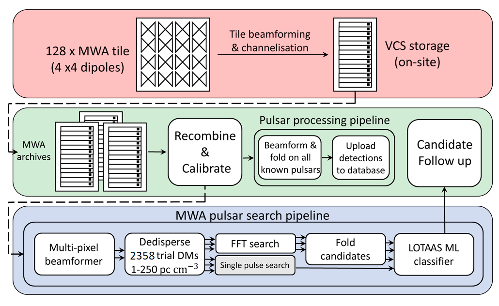

# Documentation

Full documentation for `mwa_search` is hosted at [this ReadTheDocs link](https://mwa-search.readthedocs.io/en/latest/).

## First pass workflow diagram

Workflow diagram for the first pass survey.
This figure exists as `workflow.png` in the [Overleaf document for the SMART survey description paper](https://www.overleaf.com/5344792699hjhfpkddstxg).
It is available here in both PNG and PPTX formats ([first_pass_workflow.png](first_pass_workflow.png), [first_pass_workflow.pptx](first_pass_workflow.pptx)).

