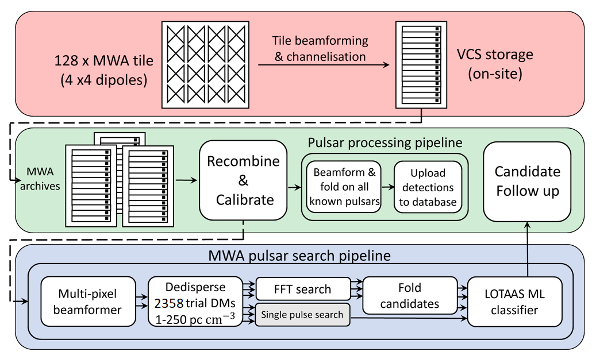

.. _smart_processing:

SMART Pulsar Search Processing
===============================

The following guide will teach you how to process SMART data for the shallow first pass search.

Overview
--------

Choosing an observation
-----------------------

You must first go to `this Google sheet <https://docs.google.com/spreadsheets/d/17ajLmbDpMoPWq-2oZZ00jPN5i3ifgIRny81SiYTPQ7o/edit?usp=sharing/>`_ to find an observation that hasn't been processed (No Y in column I).
This is only a view link, so you may have to request edit access. Once you have decided on an observation, write "downloading" in column I.
You can also see the calibrator ID that we have already processed and left on Garrawarla in Column G and the observation name in column A, note this for later.
Then log onto Garrawarla and run the following command::

    mwa_metadb_utils.py <obsid>

Doing it for obsid 1221399680, for example will output this::

    -------------------------    Obs Info    -------------------------
    Obs Name:           SMART_B01
    Creator:            stremblay
    Array phase:        P2C
    RA Pointing (deg):  320.00
    DEC Pointing (deg): -55.09
    Centrefreq (MHz):   154.24
    Channels:           [109, 110, 111, 112, 113, 114, 115, 116, 117, 118, 119, 120, 121, 122, 123, 124, 125, 126, 127, 128, 129, 130, 131, 132]
    ~FWHM (arcminute):  18.56
    FoV (square deg):   707.5
    Start time:         1221399687
    Stop time:          1221404600
    Duration (s):       4913
    Raw  files avail:   100.0%  (1/1)
    ICS  files avail:   100.0%  (4914/4914)
    Comb files avail:   100.0%  (4914/4914)

We only used the first 10 minutes of an observation for the shallow pass, so the end time we use will be the start time + 599 (because the end time is inclusive).
So for this example, the end time would be 1221400286. We should now know all the values we plan to use for the processing. Here is the data of our example::

    obsid:      1221399680
    calid:      1221342176
    obs name:   B01
    start time: 1221399687
    end time:   1221400286

Downloading and transferring
---------------------------
You can download this observation on Garrawarla and also transfer it to OZStar with the extra argument ``--ozstar_transfer`` like so::

    vcs_download.nf --obsid <obsid> --begin <start time> --end <end time> --ozstar_transfer

For this to work, you must have your ``~/.ssh/config`` set up to be able to ssh into OZStar from Garrawarla with the following command::

    ssh ozstar

You also need to transfer the calibration solutions to OZStar. This should be done from OZStar like so::

    cd /fred/oz125/vcs
    mkdir -p <obsid>/cal/<calid>/rts
    rsync garrawarla:/astro/mwavcs/${USER}/<obsid>/cal/<calid>/rts/*{dat,txt} <obsid>/cal/<calid>/rts

This will download all the calibration solutions and flagged tiles/channels files we need. Once both downloads are complete, update the google sheet so that this observation is marked as "processing" and continue to the next step.

Processing
----------
You should make a screen and in it run the following command::

    cd /fred/oz125/pulsar_search
    search_launch_loop.sh <obsid> <calid> <obsname> <start time> <end time>

This will create a grid of pointings that cover the field of view and split them into 1080 pointing batches/chunks to be done one at a time by mwa_search_pipeline.nf.

At the same time, you should make another screen and run the following command::

    cd /fred/oz125/pulsar_search
    rsync_rm_loop.sh <obsid> <calid> <obsname> <start time> <end time>

This used to transfer the candidates to Prometheus, but since we ran out of room, it deletes all the temporary files after each mwa_search_pipeline.nf batch is done to assure we don't go over our storage limit.
